# 👋 Olá! Eu sou o Jerry

⚡ **Analista de Dados | Business Intelligence | Data Analytics**

Após 10 anos como Projetista Elétrico, fiz uma transição estratégica para tecnologia em 2020.  
Hoje atuo com **análise de dados, BI e inteligência de negócios**, transformando dados em decisões.

---

## 🎯 Sobre mim

- 📊 Transformo dados em **insights estratégicos**
- 📈 Crio **dashboards interativos e KPIs de negócio**
- ⚙️ Atuo com **ETL, modelagem e qualidade de dados**
- 📡 Experiência em **telecom (B2B e B2C)**
- 🤝 Forte atuação com áreas de negócio e tecnologia

---

## 🧠 Mentalidade

- 📊 Data-driven decision making  
- 📈 Foco em geração de valor para o negócio  
- 🔄 Melhoria contínua baseada em dados  
- 🤝 Integração entre tecnologia e áreas de negócio  

---

## 🧠 Data Stack & Analytics

  

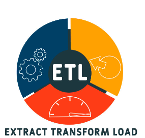

 

 
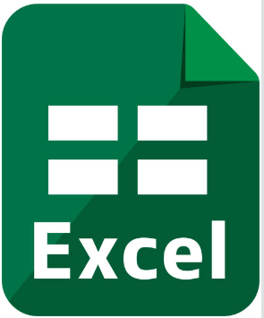
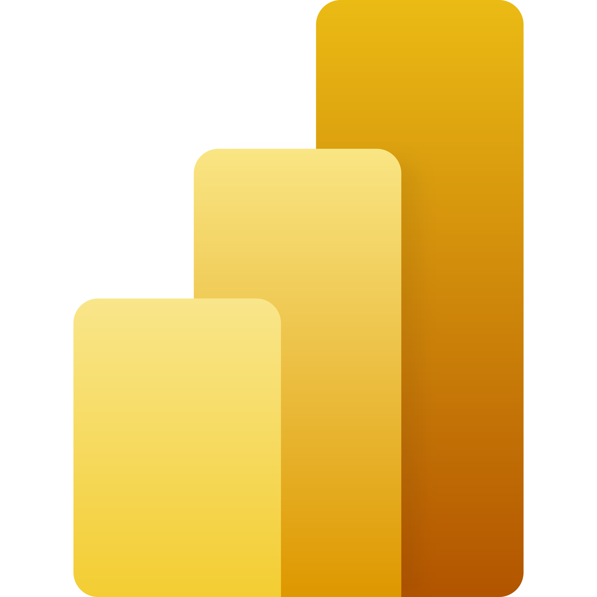
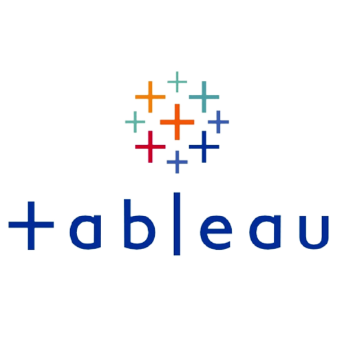

 

 

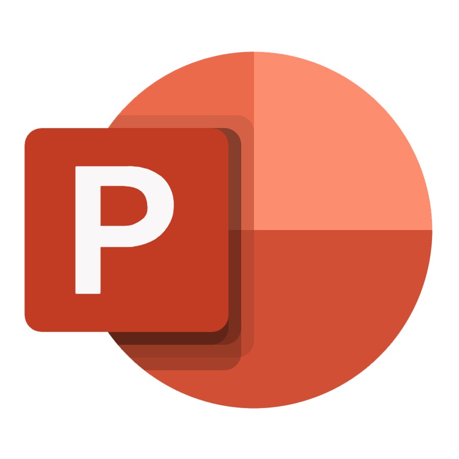
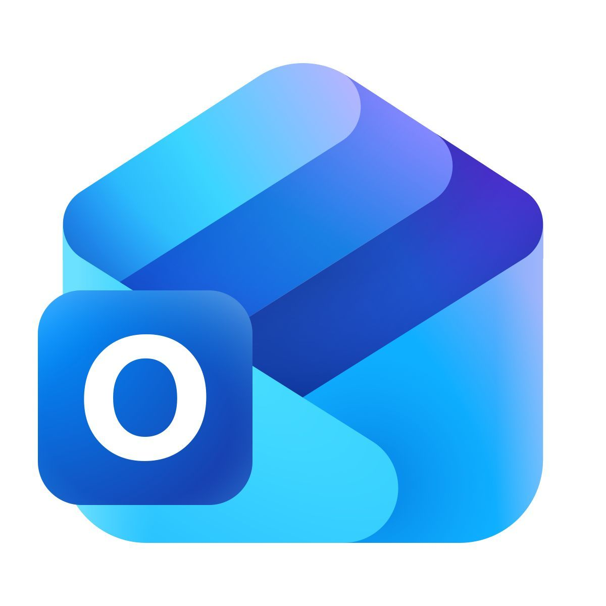

 

  
 

---
  

---

## 📊 Dashboards e Portfólio

 

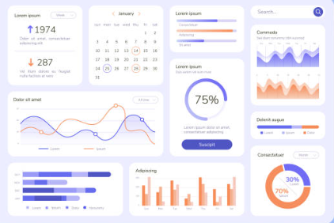
&nbsp&nbsp&nbsp&nbsp
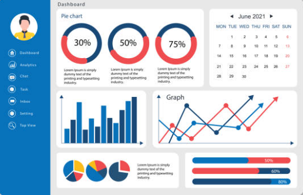
&nbsp&nbsp&nbsp&nbsp
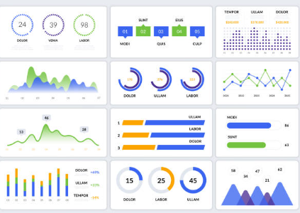
 
 
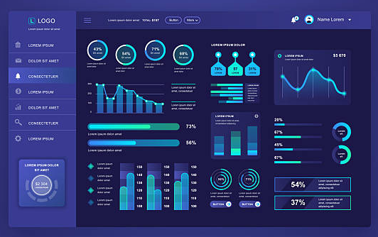
&nbsp&nbsp&nbsp&nbsp
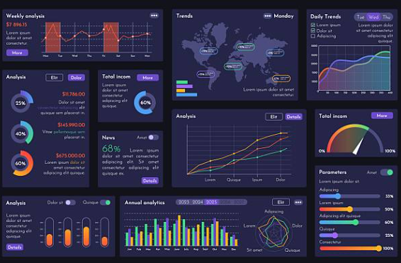

 

---

## 🏆 GitHub Stats

---

## 🌟 Interesses Profissionais 
<i>#BusinessIntelligence #DataAnalytics #SQL #Python #PowerBI #Tableau #Excel #ETL #ModelagemDeDados #ProcessosEficientes #Telecom #Automação #DashboardsInterativos</i>

---

## 📞 Contato

<a href="https://www.linkedin.com/in/jerry-w-3b6228128" target="_blank">
  
<a/>
&nbsp&nbsp&nbsp&nbsp&nbsp&nbsp
<a href="jerrysk8_2005@hotmail.com" target="_blank">
  
<a/>

 

---

